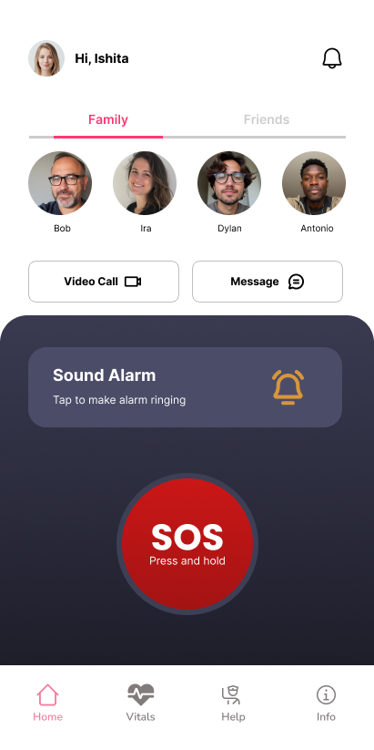
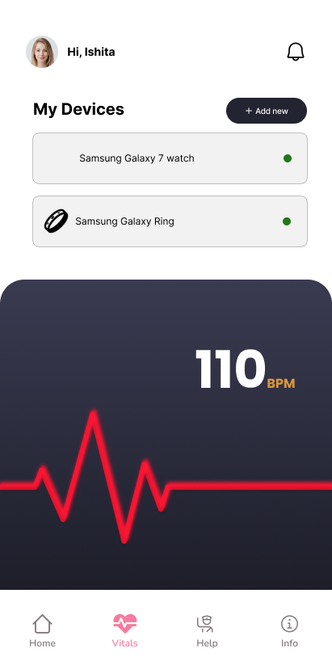
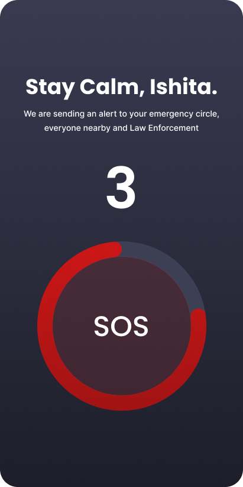
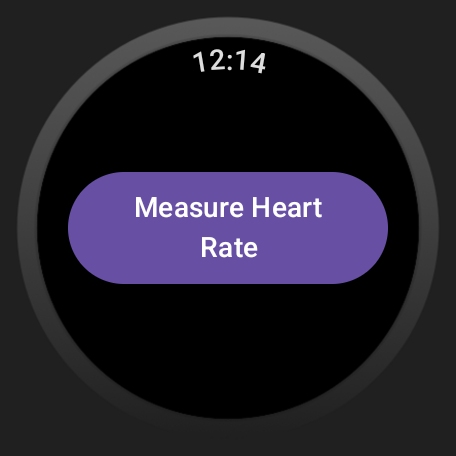
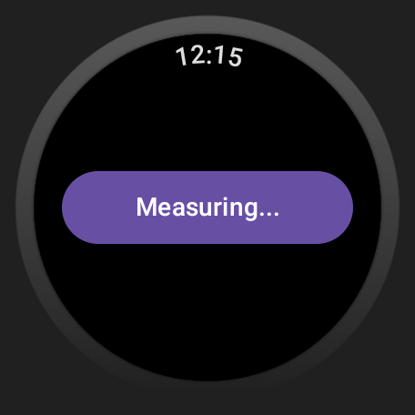

<p align="center">
  
</p>


# VSafe

> **Breaking the Silence: Innovating Safety Solutions to Deter Sexual Violence**


---

## Table of Contents

- [Overview](#overview)  
- [Features](#features)  
- [Technical Approach](#technical-approach)  
- [Architecture](#architecture)  
- [Tech Stack](#tech-stack)  
- [Screenshots / UI‑UX](#screenshots--ui‑ux)  
- [Feasibility & Viability](#feasibility--viability)  
- [Impact & Benefits](#impact--benefits)  
- [Research & References](#research--references)  
- [Contributing](#contributing)  
- [License](#license)  


---


## Overview

**VSafe** is a cutting‑edge safety solution designed to combat sexual violence against women by integrating:

- A **smart wearable** (smartwatch/fitness band)  
- An **Android mobile app** with AI‑driven monitoring  
- An **instant SOS system** with real‑time alerts, location sharing, and voice recording  

When abnormal activity or vital‑sign anomalies are detected, the app prompts an SOS. If the user cannot respond, it automatically notifies the nearest police station with live GPS coordinates and audio evidence.

---

## Features

- **AI‑Driven Monitoring**  
  - On‑device ML (TensorFlow, scikit‑learn) detects unusual patterns in movement & vitals.  
  - Server‑side ML for advanced anomaly analysis.

- **Instant SOS System**  
  - User prompt on detection; auto‑SOS if unacknowledged.  
  - Real‑time location & voice clip sent to authorities.

- **Secure Backend**  
  - JWT‑based authentication  
  - TLS/SSL for data in transit  
  - WebSockets / Socket.IO for live communication  

- **Data Storage**  
  - MongoDB for unstructured sensor logs  
  - PostgreSQL for user profiles & structured data  

---

## Technical Approach

| Component               | Technology                                  |
|-------------------------|---------------------------------------------|
| **Mobile App**          | Java, Android Studio, Wearable Data Layer API, Sensor APIs |
| **Backend Server**      | Node.js, Express.js                         |
| **Databases**           | MongoDB, PostgreSQL                         |
| **Real‑Time Comm.**     | WebSockets / Socket.IO                      |
| **Machine Learning**    | TensorFlow (on‑device), scikit‑learn, REST API integrations |
| **Security**            | JWT, TLS/SSL                                |

---

## Architecture

```plaintext
[ Smartwatch Sensors ]
         ↓
[ Wearable Data Layer API ]
         ↓
[ Android App ] ↔ [ Backend (Node.js + Express) ]
         ↘                 ↙
       [ MongoDB ]     [ PostgreSQL ]
         ↘                 ↙
      [ ML Engine & Alerting ]
         ↘
[ Emergency Services Notification ]
```

---

## Tech Stack

- **Frontend**: Android (Java), Wear OS SDK  
- **Backend**: Node.js, Express.js  
- **Databases**: MongoDB, PostgreSQL  
- **ML**: TensorFlow, scikit‑learn  
- **Security**: JWT, TLS/SSL  
- **Real‑Time**: Socket.IO  

---


## Screenshots / UI‑UX

| Login Screen | Register Screen |
|:-----------:|:----------:|
|  |  | 

| Home Screen | Vitals Screen | SOS Prompt |
|:-----------:|:----------:|:----------:|
|  |  |  | 

## Wear OS App
| Measure Screen | Progress Showcase |
|:-----------:|:----------:|
|  |  | 

---

## Feasibility & Viability

- **Technological Feasibility**  
  - Leverages existing wearable tech & public APIs.  
  - Android development achievable with open‑source tools.

- **Viability**  
  - Scales in urban/semi‑urban regions with high smartphone penetration.  
  - Affordable wearables make adoption accessible.  
  - ML anomaly detection feasible with pre‑trained models.

---

## Impact & Benefits

- **Women’s Safety**  
  - Proactive alerts deter escalation of violence.  
  - Voice recording provides key evidence for law enforcement.

- **Crime Deterrence**  
  - Rapid police notification reduces response times.  
  - Public awareness of tech‑driven prevention tools.

- **Social Good**  
  - Empowers communities to adopt preventive safety measures.  

---

## Research & References

1. **Wearable Health Devices**: Tamura et al., “Wearable Health Devices—Vital Sign Monitoring, Systems and Technologies.”  
2. **AI Anomaly Detection**: Kumar et al., “A Comprehensive Review on Health Anomaly Detection Using Machine Learning Techniques,” *Frontiers in AI*, 2020.  
3. **Digital Evidence in Law Enforcement**: Casey et al., “The Use of Digital Evidence in Investigating and Prosecuting Crimes,” 2011.  

---

## Contributing

We welcome contributions! Please:

1. Fork the repo  
2. Create a feature branch (`git checkout -b feature/XYZ`)  
3. Commit your changes (`git commit -m "Add XYZ"`)  
4. Push to your branch (`git push origin feature/XYZ`)  
5. Open a Pull Request  

---

## License

This project is licensed under the [MIT License](LICENSE).

---

## Contact

**Innovisionaries**  
- Tejas Rathi – [rathi.tejas1155@gmail.com](mailto:rathi.tejas1155@gmail.com)
- Vinayak Parashar – [vinayakbparashar@gmail.com](mailto:vinayakbparashar@gmail.com)
- Harsh
 


