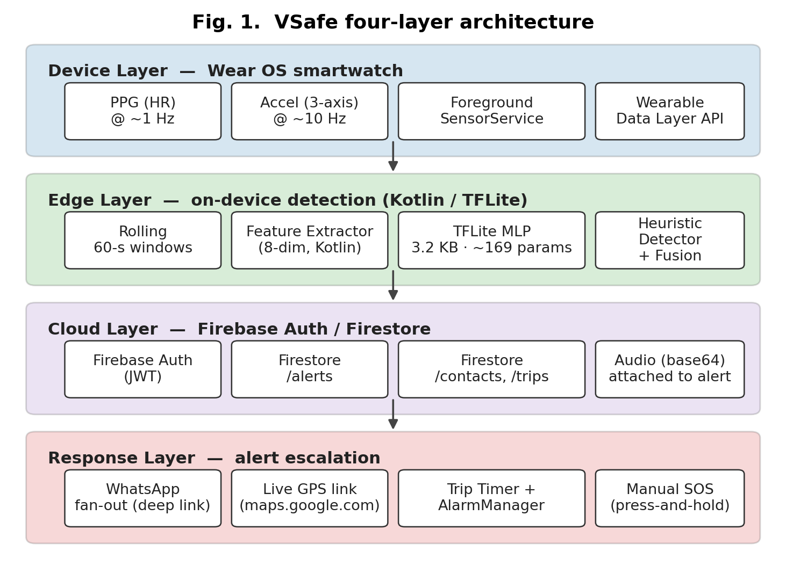

<p align="center">
  
</p>


# VSafe

> **Breaking the Silence: Innovating Safety Solutions to Deter Sexual Violence**

VSafe is a women's-safety system that pairs an Android phone app with a Wear OS smartwatch and a guardian web dashboard. The watch runs an on-device TensorFlow Lite model trained on WESAD that fuses motion + heart-rate signals with heuristic rules to detect distress. When triggered, the phone escalates to a configurable SOS — capturing audio, sharing live GPS, and notifying guardians in real time.


---

## Table of Contents

- [Highlights](#highlights)
- [Architecture](#architecture)
- [Repository Layout](#repository-layout)
- [Tech Stack](#tech-stack)
- [Features](#features)
- [Getting Started](#getting-started)
- [Machine Learning](#machine-learning)
- [Screenshots](#screenshots)
- [Roadmap & Limitations](#roadmap--limitations)
- [Contributing](#contributing)
- [License](#license)
- [Contact](#contact)


---

## Highlights

- **On-device ML** — A WESAD-trained TFLite stress detector runs entirely on the watch; no signals leave the device until an alert fires.
- **Heuristic + ML fusion** — An OR-gate merges fast hand-crafted rules with the model so either path can trigger, keeping latency low and recall high.
- **Press-and-hold SOS** — Deliberate gesture on phone *and* watch, with cancel-window and audible alarm to deter accidental triggers.
- **Trip monitoring** — Time-boxed safe-arrival check-ins with auto-escalation if the user does not confirm in time.
- **Live guardian dashboard** — Web app shows current alert location on a map, live audio playback, vitals chart, and history.
- **Graceful degradation** — Missing model assets, denied permissions, or offline state never crash the flow; fallbacks are wired throughout.


---

## Architecture



```
[ Wear OS Watch ]                 [ Android Phone ]                 [ Guardians ]
  Sensors  ──►  Feature Extractor  ──►  Wearable Data Layer  ──►  AlertOrchestrator
  HR / IMU      Rolling window         (DataClient/MessageClient)    │  ├─ Audio recorder
  ML (TFLite)   Detection Fusion ──►   Active Alert UI               │  ├─ Location stream
  Heuristic     (OR-gate)              Trip Monitor (alarm)          │  └─ Firestore writes
                                                                     ▼
                                                          [ Firebase Firestore ]
                                                                     ▼
                                                          [ Web Guardian Dashboard ]
                                                          map · audio · vitals · history
```

Detailed pipeline, fusion, and escalation diagrams live in [`paper_figures/`](paper_figures).


---

## Repository Layout

```
.
├── phoneapp/        Android phone app (Kotlin, Jetpack Compose)
├── wearapp/         Wear OS app (Kotlin, Compose for Wear, TFLite)
├── dashboard/       Static web dashboard (HTML/CSS/JS, Firebase Hosting)
├── ml/              WESAD training notebook + RESULTS.md
├── docs/            DEMO_SCRIPT.md, ML_MODEL.md
├── paper_figures/   Architecture / pipeline diagrams used in the paper
└── app_images/      Phone + watch screenshots
```


---

## Tech Stack

| Area               | Technology                                                    |
|--------------------|---------------------------------------------------------------|
| Phone app          | Kotlin, Jetpack Compose, Coroutines, Hilt-style DI            |
| Wear app           | Kotlin, Compose for Wear OS, Foreground Service, TFLite       |
| Sensors            | Wear `SensorManager` (HR + IMU), rolling-window features      |
| Phone ⇄ Watch      | Wearable Data Layer API (`DataClient`, `MessageClient`)       |
| Backend / realtime | Firebase Auth, Firestore, Cloud Storage                       |
| Dashboard          | Static HTML/CSS/JS, Leaflet map, Chart.js, Firebase Hosting   |
| ML training        | Python, scikit-learn, TensorFlow → TFLite (WESAD dataset)     |
| Build              | Gradle (Kotlin DSL), Android Gradle Plugin, version catalogs  |


---

## Features

### Phone app (`phoneapp/`)
- Auth (register / login) with Firebase
- Home dashboard with status + press-and-hold SOS
- Active alert screen with cancel window, live status, and auto-navigation when an alert fires
- Trip monitor with alarm-driven safe-arrival check-ins
- Help screen with helplines and safety tips
- About screen with limitations and team
- Polished splash with brand logo

### Wear app (`wearapp/`)
- Foreground sensor service streaming HR + IMU
- On-device TFLite inference with feature scaling and graceful asset-missing fallback
- Heuristic detector + ML detector fused via OR-gate
- SOS activity with press-and-hold confirm + audible alarm
- Alert activity reflecting live phone-side state

### Web dashboard (`dashboard/`)
- Login page
- Live map of current alert location
- Audio playback of recorded clip
- Vitals chart from alert window
- Alert history list


---

## Getting Started

### Prerequisites
- Android Studio (Hedgehog or newer)
- JDK 17
- A Firebase project (Auth + Firestore + Storage enabled)
- Optional: a paired Wear OS device or emulator

### 1. Clone
```bash
git clone https://github.com/tejas-rathi05/SakhiSafe.git
cd SakhiSafe
```

### 2. Wire up Firebase
Drop your `google-services.json` into both `phoneapp/` and `wearapp/`. Enable Email/Password auth and create the Firestore collections referenced by `AlertOrchestrator`.

### 3. Build and install
```bash
./gradlew :phoneapp:installDebug
./gradlew :wearapp:installDebug
```
On Windows use `gradlew.bat`.

### 4. Dashboard (optional)
```bash
cd dashboard
firebase login
firebase deploy --only hosting
```
Set the same Firebase project so the web app reads the same Firestore data.


---

## Machine Learning

The detector is trained on the [WESAD](https://archbee.com/blog/wesad-dataset) dataset using the notebook at [`ml/train_wesad.ipynb`](ml/train_wesad.ipynb). The pipeline:

1. Window the raw HR + accelerometer signals (rolling window matching watch-side runtime)
2. Extract hand-crafted features (mean/std/min/max/HR-derived)
3. Train + evaluate (LOSO cross-validation; metrics in [`ml/RESULTS.md`](ml/RESULTS.md))
4. Export to TFLite + a JSON feature scaler bundled into [`wearapp/src/main/assets/`](wearapp/src/main/assets)

Detection on-device runs in `wearapp/.../detection/DetectionFusion.kt`, fusing the model output with a heuristic detector via an OR-gate. See [`docs/ML_MODEL.md`](docs/ML_MODEL.md) for the full write-up.


---

## Screenshots

### Phone
| Home | Vitals / Alert | SOS |
|:---:|:---:|:---:|
|  |  |  |

### Wear OS
| Measure | Active alert |
|:---:|:---:|
|  |  |

Newer captures live in [`app_images/`](app_images).


---

## Roadmap & Limitations

- **Battery vs. sample rate** — current sensor windowing is tuned for demo runs; production tuning needed.
- **Single-user demo data** — model is trained on WESAD, not a women-specific distress corpus.
- **Geofenced helplines** — helpline list is static; future work to localize by region.
- **Offline alerts** — alerts require connectivity to reach the dashboard; SMS fallback is on the roadmap.

A more detailed contingency list is in [`docs/DEMO_SCRIPT.md`](docs/DEMO_SCRIPT.md).


---

## Contributing

1. Fork the repo
2. Create a feature branch (`git checkout -b feature/XYZ`)
3. Commit your changes (`git commit -m "Add XYZ"`)
4. Push to your branch (`git push origin feature/XYZ`)
5. Open a Pull Request


---

## License

This project is licensed under the [MIT License](LICENSE).


---

## Contact

**Innovisionaries**
- Tejas Rathi – [rathi.tejas1155@gmail.com](mailto:rathi.tejas1155@gmail.com)
- Vinayak Parashar – [vinayakbparashar@gmail.com](mailto:vinayakbparashar@gmail.com)
- Harsh
